<picture>
  <source media="(prefers-color-scheme: dark)" srcset="./dark.svg">
  <source media="(prefers-color-scheme: light)" srcset="./light.svg">
  
</picture>

 

---

## 👨‍💻 About Me

I'm **Siddharth S S**, a developer interested in building practical software, web applications, automation tools, and developer-focused projects.

I enjoy taking ideas from **concept → implementation → testing → deployment**, while continuously improving my software development and engineering skills.

- 🐍 Focused on **Python development**
- 🌐 Interested in **web development and backend systems**
- 🛠️ Building **developer tools and practical applications**
- 🗄️ Working with **MySQL and MongoDB**
- 🧪 Interested in **testing, automation, and reliable software**

---

## 🚀 Featured Project

### [github-profile-toolkit](https://github.com/siddharth-ss/github-profile-toolkit)

A Python developer toolkit for creating, validating, and maintaining professional GitHub profiles and profile README files.

 

### Highlights

- 🐍 Built with Python
- 🔄 GitHub Actions CI
- 📦 Python package structure
- 🖥️ Command-line tooling
- 📖 Documentation and changelog
- 🏷️ Versioned release workflow

---

## 🧰 Tech Stack & Skills

### 💻 Programming & Web

  

### ⚙️ Backend & Databases

  

### 🛠️ Development & Systems

  

### 🎨 Creative & Media

  
  
  
  

---

**Build it. Test it. Improve it. Ship it.**

